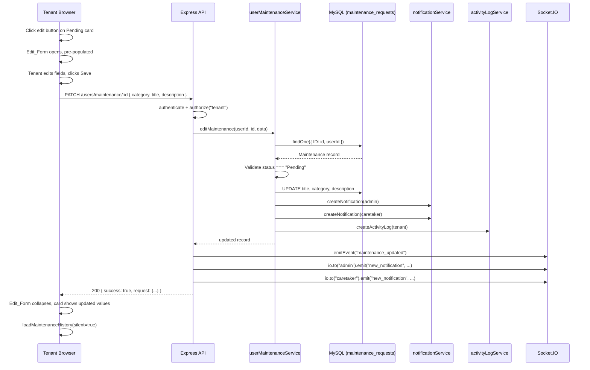

# Design Document

## Tenant Maintenance Edit

---

## Overview

This feature adds inline editing to the tenant maintenance request history. Tenants can edit the `title`, `category`, and `description` of a maintenance request while it remains in **Pending** status. Requests in any other status (`Approved`, `In Progress`, `Done`) are read-only.

The implementation touches three layers:

1. **Frontend** — `Maintenance.jsx` gains edit-mode state per card, an inline `Edit_Form`, and a new API call.
2. **Backend service** — `userMaintenanceService.js` gains an `editMaintenance` function that validates ownership and status, persists the update, sends notifications, and logs the action.
3. **Backend route/controller** — a new `PATCH /users/maintenance/:id` endpoint wired through the existing auth middleware.

No schema changes are required; the existing `maintenance_requests` table already has `title`, `category`, and `description` columns.

---

## Architecture



---

## Components and Interfaces

### Backend

#### New service function — `userMaintenanceService.js`

```js
editMaintenance(userId: number, maintenanceId: number, data: {
  category: string,
  title: string,
  description?: string
}): Promise<{ id, title, category, description, status, requestedDate }>
```

Validation rules enforced inside the service:
- `title` must be a non-empty string after trimming.
- `category` must be one of `"Electrical Maintenance"`, `"Water Interruptions"`, `"Floor Renovation"`, `"Other"`.
- The record must exist and `userId` must match the authenticated tenant.
- `status` must be `"Pending"` — any other status throws an error.

#### New controller function — `userMaintenanceController.js`

```js
editMaintenanceRequest(req, res)
```

Calls `editMaintenance`, emits `maintenance_updated` via `emitEvent`, pushes `new_notification` to `admin` and `caretaker` Socket.IO rooms, returns `200`.

#### New route — `userMaintenanceRoutes.js`

```
PATCH /users/maintenance/:id
  → authenticate → authorize("tenant") → editMaintenanceRequest
```

### Frontend

#### New API function — `maintenanceAPI.js`

```js
editMaintenanceRequest(id: number, payload: { category, title, description }): Promise<any>
// PATCH /users/maintenance/:id
```

#### State additions in `Maintenance.jsx`

| State variable | Type | Purpose |
|---|---|---|
| `editingId` | `number \| null` | ID of the card currently in edit mode; `null` = none |
| `editDraft` | `{ category, title, description }` | Working copy of the fields being edited |
| `editError` | `string \| null` | Inline validation/server error message |
| `isSaving` | `boolean` | Disables Save button during PATCH request |

#### Edit_Form component (inline, inside the history card)

Rendered when `editingId === item.id`. Contains:
- `<select>` for `category` (same `CATEGORIES` array)
- `<input type="text">` for `title` (required)
- `<textarea>` for `description` (optional)
- Save button (disabled while `isSaving`)
- Cancel button

Opening an edit form sets `editingId` to the new card's ID, which automatically closes any previously open form (single-edit-mode invariant).

---

## Data Models

No schema migrations required. The existing `Maintenance` Sequelize model already defines all needed columns:

| Column | Type | Notes |
|---|---|---|
| `ID` | BIGINT UNSIGNED PK | |
| `userId` | BIGINT UNSIGNED | Ownership check |
| `category` | ENUM | 4 allowed values |
| `title` | STRING(255) | Required |
| `description` | TEXT | Optional (currently `allowNull: false` in model — service will pass `""` when empty) |
| `status` | ENUM | Must be `"Pending"` to allow edit |

The `getTenantMaintenance` response shape already returns `description` from the DB but the current mapping in the service omits it. The `editMaintenance` function will return `description` in its response, and `getTenantMaintenance` will be updated to include `description` in its mapped output so the frontend can pre-populate the edit form.

---

## Correctness Properties

*A property is a characteristic or behavior that should hold true across all valid executions of a system — essentially, a formal statement about what the system should do. Properties serve as the bridge between human-readable specifications and machine-verifiable correctness guarantees.*

### Property 1: Edit button visibility is determined by status

*For any* maintenance request, the edit button SHALL be present in the rendered History_Card if and only if the request's status is `"Pending"`. For any non-Pending status (`"Approved"`, `"In Progress"`, `"Done"`), no edit button SHALL appear.

**Validates: Requirements 1.1, 1.2**

---

### Property 2: Edit form pre-populates with current request values

*For any* Pending maintenance request, when the Edit_Form is opened, each field (`category`, `title`, `description`) SHALL contain exactly the current value stored in the request record.

**Validates: Requirements 2.2**

---

### Property 3: Cancel reverts to original read-only display

*For any* Pending maintenance request and any set of in-progress edits, clicking Cancel SHALL close the Edit_Form and restore the History_Card to displaying the original unmodified values.

**Validates: Requirements 2.4**

---

### Property 4: Only one card may be in edit mode at a time

*For any* list of Pending maintenance request cards, opening the Edit_Form on one card SHALL cause any previously open Edit_Form to collapse and discard its unsaved changes, so that at most one card is in edit mode at any given time.

**Validates: Requirements 2.5**

---

### Property 5: Title validation rejects empty and whitespace-only strings

*For any* string composed entirely of whitespace characters (including the empty string), attempting to save the Edit_Form SHALL be rejected: the form SHALL NOT submit the PATCH request and SHALL display an inline validation error.

**Validates: Requirements 3.1, 3.3**

---

### Property 6: Category validation accepts only the four allowed values

*For any* category value that is not one of `"Electrical Maintenance"`, `"Water Interruptions"`, `"Floor Renovation"`, or `"Other"`, the backend `editMaintenance` service SHALL reject the request with an error.

**Validates: Requirements 3.2**

---

### Property 7: Backend only edits requests owned by the tenant and in Pending status

*For any* edit attempt, the backend SHALL apply the update if and only if both conditions hold: (a) the `userId` on the record matches the authenticated tenant's ID, and (b) the record's `status` is `"Pending"`. Any attempt where either condition fails SHALL return an error (403 for ownership failure, 400 for wrong status) and leave the record unchanged.

**Validates: Requirements 4.2, 4.3, 4.4**

---

### Property 8: Successful edit notifies both admin and caretaker

*For any* successfully edited maintenance request, the `editMaintenance` service SHALL invoke `createNotification` exactly once for `role="admin"` and exactly once for `role="caretaker"`, both with `type="maintenance update"`, `title="Maintenance Request Edited"`, and a message that references the updated request title.

**Validates: Requirements 5.1, 5.2**

---

### Property 9: Successful edit emits the maintenance_updated socket event

*For any* successfully edited maintenance request, the controller SHALL call `emitEvent` with the event name `"maintenance_updated"` so that connected clients refresh their views.

**Validates: Requirements 5.3**

---

### Property 10: Successful edit creates a complete activity log entry

*For any* successfully edited maintenance request, `createActivityLog` SHALL be called with `action="EDIT MAINTENANCE"`, `role="tenant"`, the tenant's `userId`, a `description` string that contains the updated request title, `referenceId` equal to the maintenance record's `ID`, and `referenceType="maintenance"`.

**Validates: Requirements 6.1, 6.2**

---

## Error Handling

| Scenario | Backend response | Frontend behaviour |
|---|---|---|
| `title` is empty/whitespace | Client-side only — no request sent | Inline error below title field; Save button remains disabled |
| `category` is invalid | `400 { success: false, message: "Invalid category" }` | Edit_Form shows server error message |
| Request not found | `400 { success: false, message: "Maintenance request not found" }` | Edit_Form shows error message |
| Request not owned by tenant | `403 { success: false, message: "..." }` | Edit_Form shows error message |
| Request status is not Pending | `400 { success: false, message: "Only pending requests can be edited" }` | Edit_Form shows error message; tenant should reload |
| Network / server error | `500` | Edit_Form shows generic error message; form stays open |

All errors set `editError` state in the frontend, which is rendered as an inline message inside the Edit_Form. The form is never auto-closed on error so the tenant can correct and retry.

---

## Testing Strategy

### Unit / Example-based tests

- Render a History_Card with each status value and assert edit button presence/absence.
- Open Edit_Form on a card, assert fields are pre-populated.
- Open Edit_Form, click Cancel, assert original values are displayed.
- Open Edit_Form on card A, then open on card B, assert card A is no longer in edit mode.
- Submit with empty description, assert success.
- Submit with empty title, assert inline error and no API call.

### Property-based tests (using [fast-check](https://github.com/dubzzz/fast-check))

Each property test runs a minimum of **100 iterations**.

Tag format: `Feature: tenant-maintenance-edit, Property {N}: {property_text}`

| Property | What is generated | What is asserted |
|---|---|---|
| P1 — Edit button visibility | Random `status` values from the full enum | Button present iff status is `"Pending"` |
| P2 — Pre-population | Random `{ category, title, description }` objects | Each form field equals the corresponding request value |
| P3 — Cancel reverts | Random requests + random draft edits | After cancel, displayed values equal original request values |
| P4 — Single edit mode | Random list of ≥2 Pending requests | After opening card N's form, all other cards have `editingId !== their id` |
| P5 — Title validation | Arbitrary whitespace strings (empty, spaces, tabs, newlines) | No PATCH call made; `editError` is non-null |
| P6 — Category validation | Arbitrary strings | Service throws for any value outside the four allowed categories |
| P7 — Backend authorization | Random `(userId, requestUserId, status)` triples | Update applied only when `userId === requestUserId && status === "Pending"` |
| P8 — Notifications | Random valid edit payloads | `createNotification` called twice with correct role/type/title |
| P9 — Socket emission | Random valid edit payloads | `emitEvent` called with `"maintenance_updated"` |
| P10 — Activity log | Random valid edit payloads | `createActivityLog` called with all required fields matching input |

### Integration tests

- `PATCH /users/maintenance/:id` with a valid tenant JWT and a Pending request → `200` with updated fields.
- `PATCH /users/maintenance/:id` with a non-owner tenant JWT → `403`.
- `PATCH /users/maintenance/:id` on an Approved/In Progress/Done request → `400`.
- `GET /users/maintenance/my` after an edit → response includes updated `description` field.
